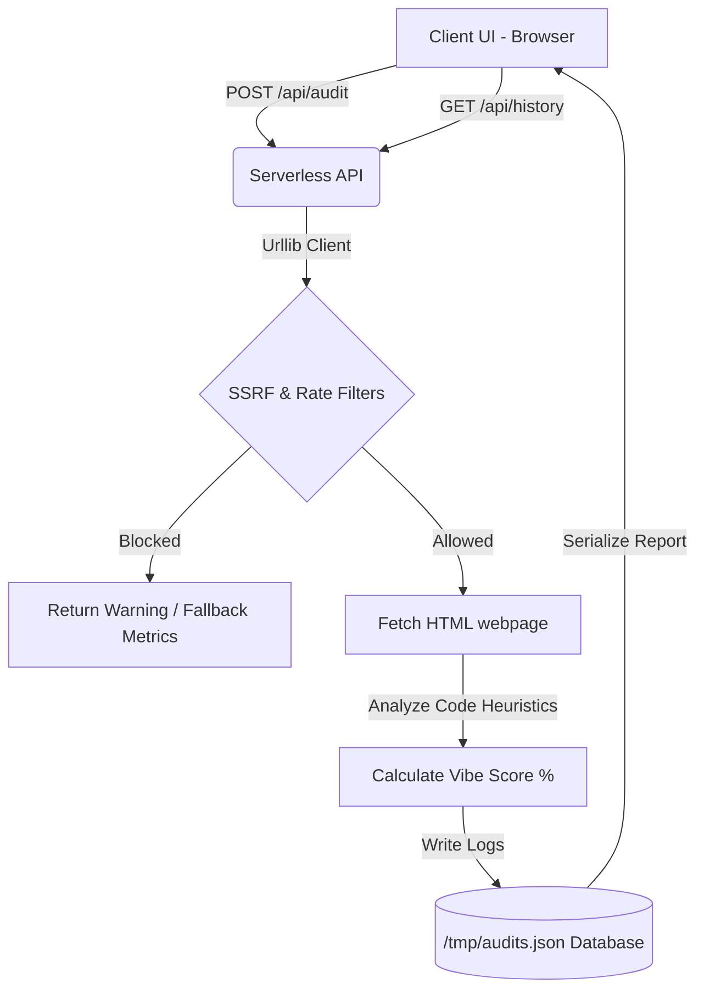

# 🔮 Is It Vibe Coded? | Heuristic AI Web Detector

A premium, high-fidelity web application that audits any website or app to determine if it was **"vibe coded"** (rapidly orchestrated using AI agents, LLM prompting, and builders) or meticulously **hand-crafted** line-by-line by human engineers.

Built with a **Python Serverless Backend** and a **Vanilla CSS/HTML/JS Glassmorphic Frontend**, this project runs locally and deploys seamlessly to Vercel Serverless.

---

## 🚀 Key Features

*   **Live Scraper Engine**: Fetches public site HTML (respecting redirects and handling HTTP 308 blocks) to run real-time static code analysis.
*   **Agentic Blueprint Detection**: Runs complex regex heuristic algorithms looking for signatures left by AI assistants (like Cursor, Lovable, Bolt.new, v0, and Antigravity):
    *   *Tailwind CSS Saturation*: Evaluates the density of utility class tags.
    *   *Lucide Icon Footprint*: Scans for linear vector icon package signatures.
    *   *Shadcn UI & Radix Primitives*: Identifies state wrappers and scaffold structures.
    *   *LLM Layout Clichés*: Flags common conversational copy slogans (*"Streamline your workflow"*, *"Revolutionize productivity"*).
    *   *Single-File Packaging*: Recognizes long inline `<style>` and `<script>` structures typical of prompt-scaffolded pages.
    *   *Mobile UI Constraints*: Scans for viewport locked mobile zoom configurations (`user-scalable=no`).
*   **Security & Compliance Guard**:
    *   *Anti-SSRF Protection*: Prevents DNS rebinding and local scanning by blocking loopback range resolves (`127.x.x.x`), RFC 1918 subnets (`192.168.x.x`, `10.x.x.x`, `172.16.x.x`), and cloud metadata APIs (`169.254.169.254`).
    *   *Polite Rate Limiting*: Restricts crawls to 1 scan per host every 3 seconds.
    *   *Download Size Ceiling*: Hard limit of 250KB per fetch to prevent memory exploitation.
*   **Audit Registry & Feed**: Dynamic, search-filterable log of previously audited domains.
*   **Checklist Wizard**: Interactive manual diagnostic form to estimate vibe scores for localhost profiles or pages behind authentication walls.
*   **Consensus & Comments**: Let visitors vote on the audit grade and leave developer notes.

---

## 🛠️ Architecture



---

## 💻 Local Quickstart

No dependencies are required. The project runs directly using the Python 3 standard library.

1.  **Clone the Repository**:
    ```bash
    git clone https://github.com/manojnagendra/is-it-vibe-coded.git
    cd is-it-vibe-coded
    ```
2.  **Start the Local Server**:
    ```bash
    python3 server.py
    ```
3.  **Browse the App**:
    Open [http://localhost:8080](http://localhost:8080) in your web browser.

---

## ☁️ Vercel Deployment

This repository is optimized for Vercel Serverless out of the box using `vercel.json` rewrites and Python serverless functions in the `api/` directory:

1.  Push the repository to GitHub.
2.  Import the repository on [Vercel.com](https://vercel.com).
3.  Vercel will automatically discover the `/api` directory and deploy it as serverless handlers.

---

## 📄 License

This project is licensed under the MIT License - see the [LICENSE](LICENSE) file for details.
